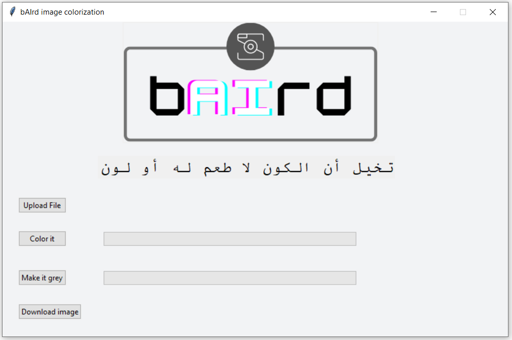
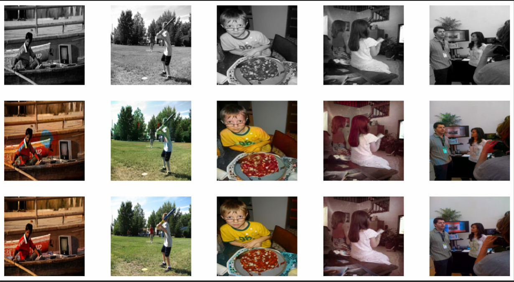
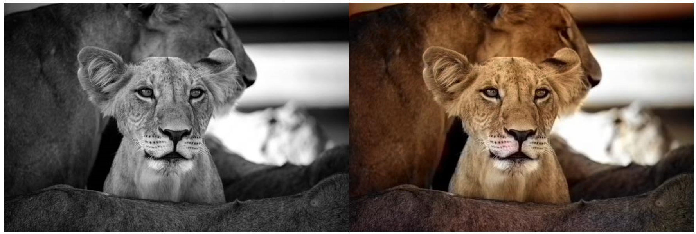
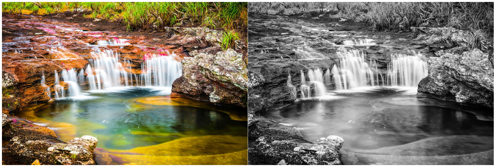

# bAIrd | Image Colorization



## Team Members

**Abeer Shboul**

**Ihab Abbas**

**Omar Darwish**

**Osama Elddadow**

**Shaden Shanab**

**Yazan Alfarra**

## Project Description

One of the most exciting applications of deep learning is colorizing black and white images. This task needed a lot of human input and hardcoding several years ago but now the whole process can be done end-to-end with the power of AI and deep learning. Colorization is a process of converting grayscale images into visually acceptable color images. The main goal is to convince the viewer of the authenticity of the result by combining the GAN and the U-NET methodologies.

## Installing the requirements

```
pip install -r requirements.txt
```

## How to run the model

```
python -m model.model
```
or
```
jupyter run model.ipynb 
```

## How to run the program

```
python -m scripts.user_interface
```

## Model results



## Program results

**From Grayscale to RGB**



**From RGB to Grayscale**



## References and Acknowledgements

[1] <https://docs.python.org/3/library/tk.html>


[2] <https://colab.research.google.com/drive/10XqGFayZqXYCMwPR1Z74doq_RiOlIySz?usp=sharing#scrollTo=26uIl2XGkgcN>

[3] <https://realpython.com/generative-adversarial-networks/>

[4] <https://docs.fast.ai/quick_start.html>

[5] <https://www.geeksforgeeks.org/python-opencv-cv2-imread-method/>

[6] <https://www.codespeedy.com/automatic-colorization-of-black-and-white-images-using-ml-in-python/>

[7] <https://cocodataset.org/#home>

[8] <https://colab.research.google.com/github/moein-shariatnia/Deep-Learning/blob/main/Image%20Colorization%20Tutorial/Image%20Colorization%20with%20U-Net%20and%20GAN%20Tutorial.ipynb#scrollTo=x9tYsW-ymdUL>

[9] <https://drive.google.com/drive/folders/1VDdLRZAsGp_jAhjZo7w49yMsRf4qS_8d>

[10] <https://github.com/phillipi/pix2pix>

[11] <https://github.com/richzhang/colorization>

[12] <https://github.com/richzhang/colorization/tree/caffe>

[13] <https://towardsdatascience.com/unet-line-by-line-explanation-9b191c76baf5>

[14] <https://www.youtube.com/watch?v=sj1-OO5AGmc&ab_channel=Simplilearn>

[15] <https://www.youtube.com/watch?v=xBX2VlDgd4I&ab_channel=DigitalSreeni>

[16] <https://www.youtube.com/watch?v=Mng57Tj18pc&ab_channel=DigitalSreeni>

[17] <https://www.youtube.com/watch?v=azM57JuQpQI&ab_channel=DigitalSreeni>